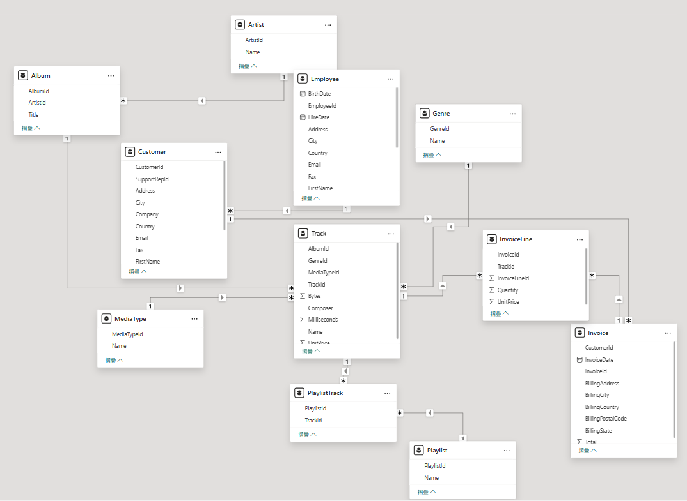
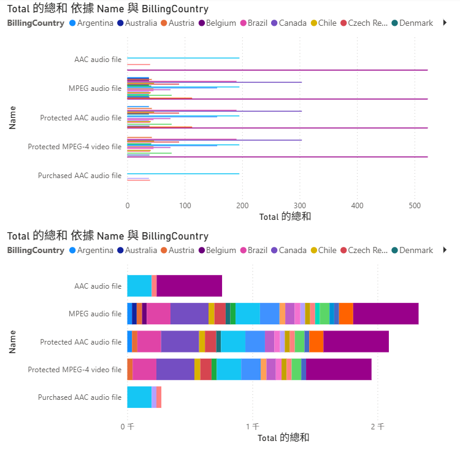
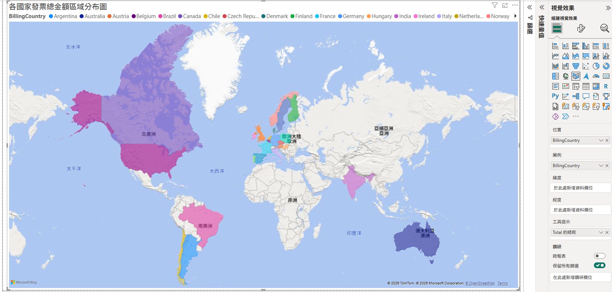

# 第1次作業題目-作業-HW1
>
>學號：112111108  
> 
>姓名：詹羽庭
>

## 說明程式與內容

1. 

在模型檢視裡可以看到，Employee與Customer為一對多關係，一位員工可以服務多位顧客；
Customer與Invoice 也是一對多關係，代表一位顧客可以產生多張發票。
Invoice與Track 並非直接關聯，而是透過InvoiceLine作為中介資料表，
Invoice對InvoiceLine 為一對多，Track對InvoiceLine也為一對多。
因此整體的資料模型可以用來從員工、顧客、發票一路追蹤到購買的音樂軌道資料。
2. 
 
兩個圖表皆用MediaType的Name作為Y軸，Invoice的Total作為X軸，並以Invoice的BillingCountry作為圖例。
目的是比較不同媒體類型所產生的發票總金額，同時觀察各帳單國家在不同媒體類型中的金額分布情形。
群組橫條圖可以清楚比較同一個媒體類型下，不同BillingCountry之間的Total差異；
堆疊橫條圖則可以保留每個媒體類型的總金額概念，並進一步看出該總額是由哪些BillingCountry組成。
群組圖較適合比較國家之間的差距，堆疊圖較適合觀察整體總額與組成比例。

3. 

本圖使用 Invoice 資料表中的BillingCountry作為地理位置，並以Invoice資料表中的Total總和作為工具提示資料，呈現不同國家或地區的發票總金額分布。
透過區域分布圖，可以直接觀察Chinook資料庫中消費來源分布在哪些國家。
這張圖的目的有兩個：第一，是比較不同BillingCountry的發票總金額差異；
第二，是觀察銷售金額在地理位置上的分布情形。
由圖可知，Chinook的銷售資料分布於北美、南美、歐洲、亞洲與澳洲等地，因此區域分布圖能幫助我們快速了解各國家銷售來源的分布狀況。